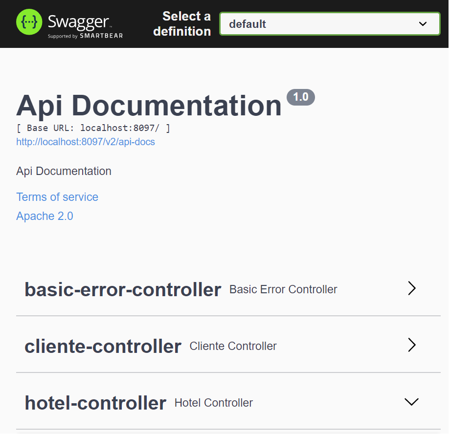
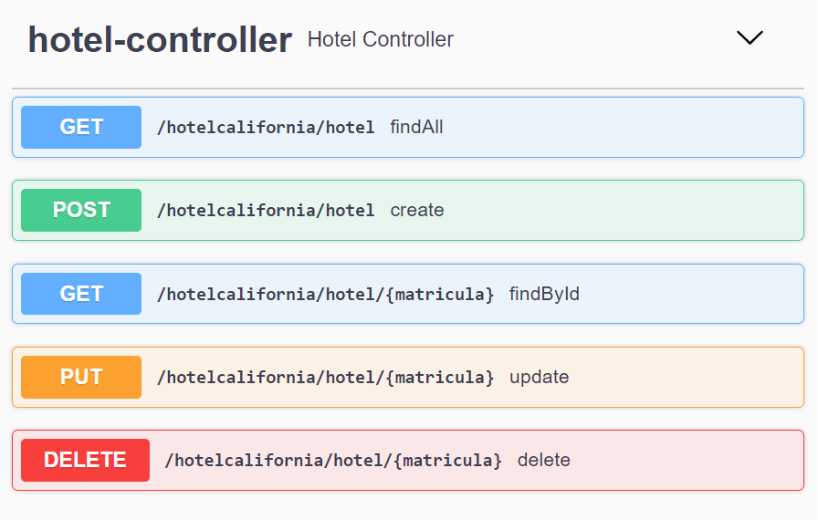
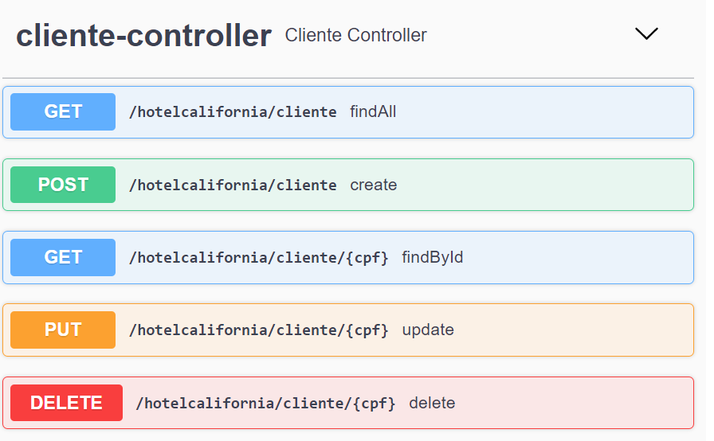

<h1>Hotel Califórnia</h1>
<h3>API REST HOTEL CALIFÓRNIA</h3>

Projeto feito com base no que foi aprendido nas aulas da escola de tecnologia Fuctura.

O projeto consiste na criação de uma API que servirá para cadastrar hoteis e seus respectivos clientes.

<strong>Tecnologias utilizadas:</strong>
<ul>
  <li>Linguagem Java 8</li>
  <li>MySQL (Banco de Dados)</li>
  <li>Spring Boot</li>
  <li>Swegger</li>
  <li>Maven</li>
  <li>JPA</li>
  <li>Hibernate</li>
  <li>Lombok</li>
  <li>RESTful</li>
  <li>Apache Tomcat</li>
  <li>IDE Eclipse</li>
</ul>

<strong>Métodos utilizados para os serviços da classe Hotel:</strong>
<ul>
  <li>findAll(GET) - http://localhost:8097/hotelcalifornia/hotel</li>
  <li>findById(GET) - http://localhost:8097/hotelcalifornia/hotel/{matricula}</li>
  <li>create(POST) - http://localhost:8097/hotelcalifornia/hotel</li>
  <li>update(PUT) -http://localhost:8097/hotelcalifornia/hotel</li>
  <li>delete(DELETE) - http://localhost:8097/hotelcalifornia/hotel/{matricula}</li>
</ul>

 
<strong>Métodos utilizados para os serviços da classe Cliente:</strong>
<ul>
  <li>findAll(GET) - http://localhost:8097/hotelcalifornia/cliente</li>
  <li>findById(GET) - http://localhost:8097/hotelcalifornia/cliente/{cpf}</li>
  <li>create(POST) - http://localhost:8097/hotelcalifornia/cliente</li>
  <li>update(PUT) -http://localhost:8097/hotelcalifornia/cliente</li>
  <li>delete(DELETE) - http://localhost:8097/hotelcalifornia/cliente/{cpf}</li>
</ul>

<strong>(Obs: O arquivo com os scripts de criação do banco de dados e das tabelas estão na pasta BD dentro da pasta do projeto)</strong>
